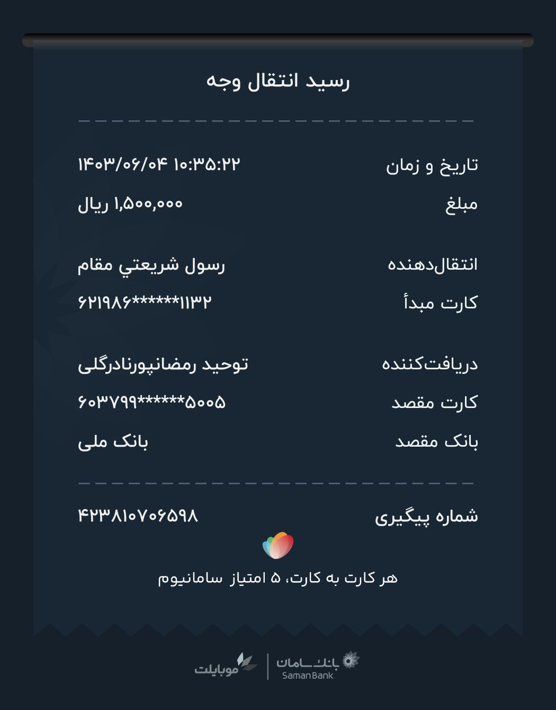
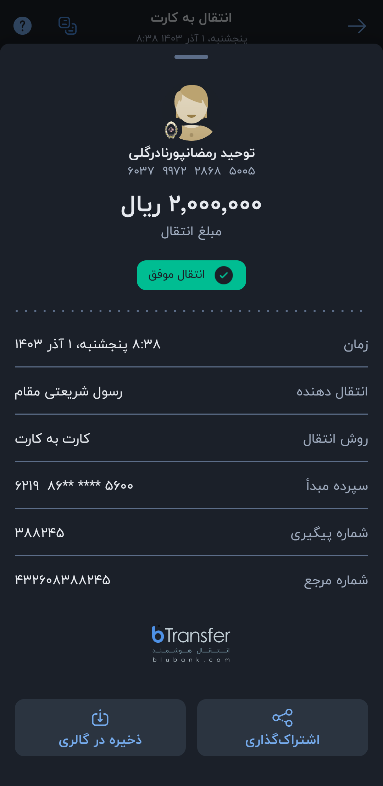
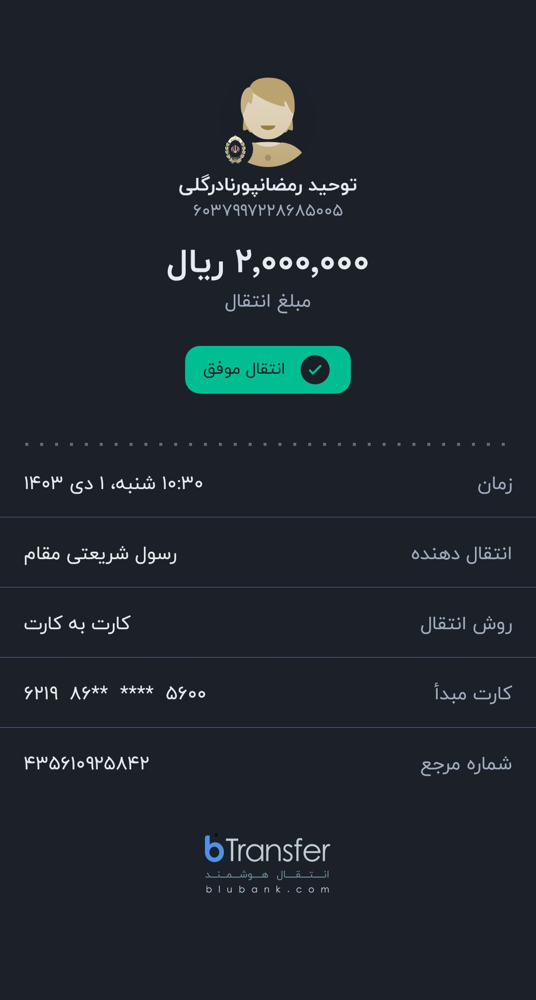
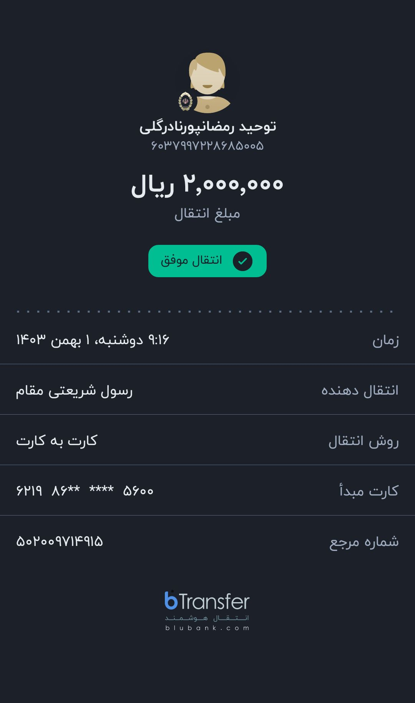

# رسیدهای پرداخت‌ شارژ ساختمان سال ۱۴۰۳  

   

## شهریور ماه ۱۴۰۳   

  
   
  <em>شهریور، به ما گفته بودن هزینه شارژ ۱۵۰ هزار تومن هستش </em>

---  

    

## مهر ماه ۱۴۰۳     
از طریق atm بانک ملت پرداخت شد که کاغذ نداشت برای ارائه رسید، ۱۵۰ هزار تومان واریز شد   

---  

    

## آبان ماه ۱۴۰۳  

  
   
  <em>آبان‌ماه، بعد از پرداخت ۱۵۰ تومن آقای رمضان‌پور مدیر ساختمون عزیزمون گفتن که شارژ ۱۵۰ نیست ۲۰۰ تومن شده، عذرخواهی کردم و پنجاه تومن باقی مونده رو زدم، رسید پایینی مربوط به همینه </em>

  

---  

     

   
   
  <em> پنجاه تومن مابه‌التفاوت آبان ماه رو واریز شد </em>

  

---   

     

   
    
   <em>آقای رمضان‌پور گفتن خیلی وقته که شارژ ۲۰۰ تومن شده و باید مابه‌التفاوت دوماه اول هم بزنید. یعنی صد هزار تومن. اطاعت امر شد </em>

    

---  

    

## آذرماه ۱۴۰۳   

     
    
   <em> آذر ماه </em>

  

---  

     

## دی ماه ۱۴۰۳  

   
    
   <em> دی‌ ماه </em>

   

---  

     

## بهمن ماه ۱۴۰۳  

   
    
   <em> بهمن‌ ماه </em>

   

---  

     

## اسفند ماه  

   
    
   <em> اسفند ماه </em>

   

### [مشاهده رسید‌های سال جدید (۱۴۰۴)](./index.md)

