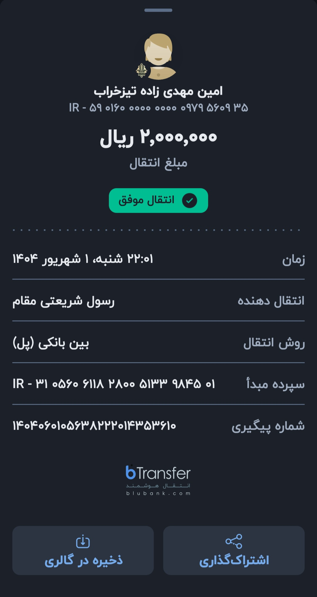
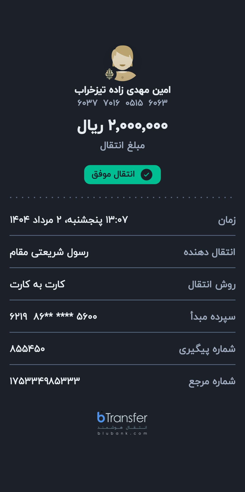
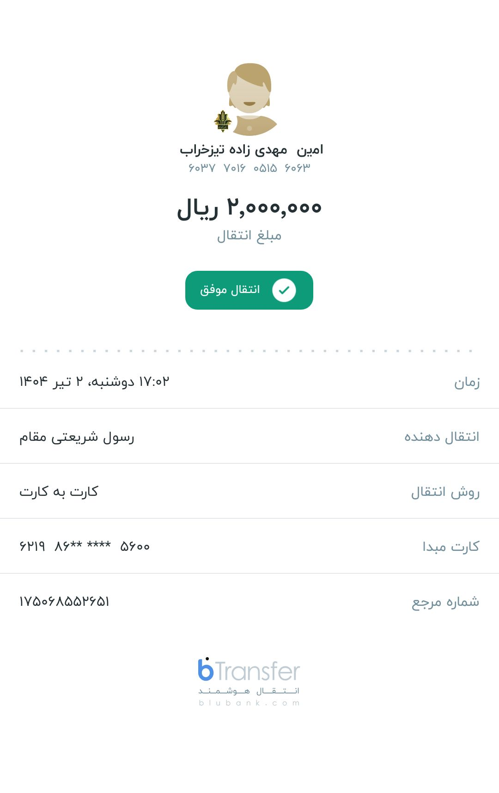
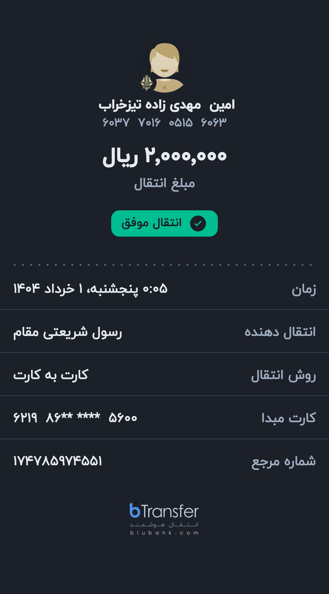
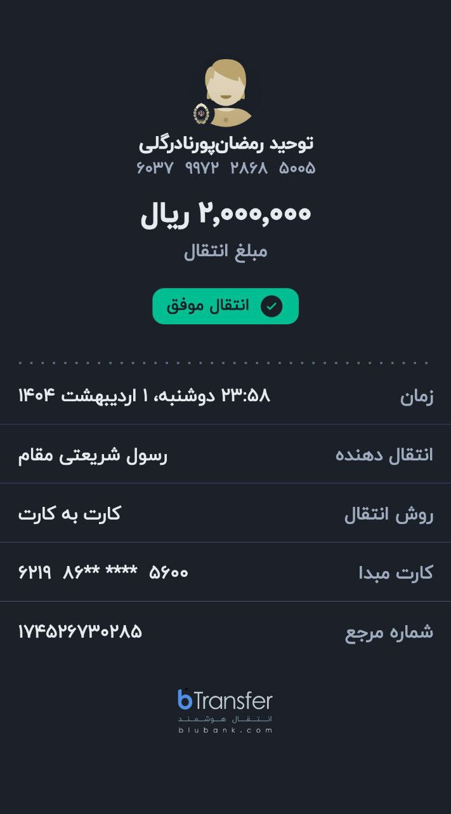
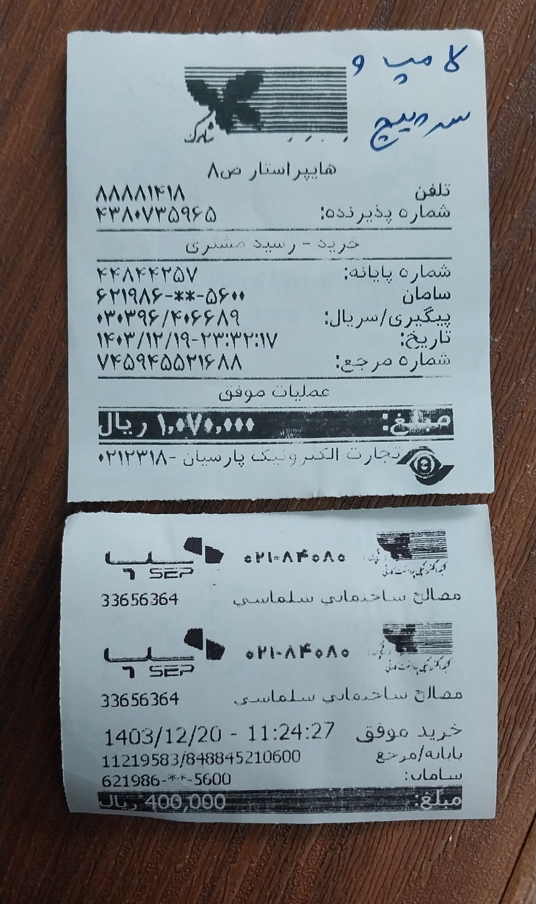
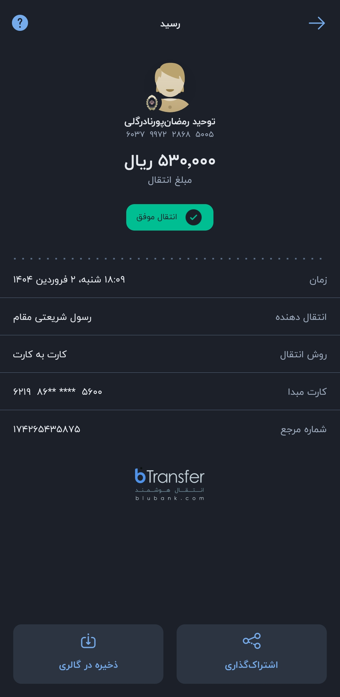

---
layout: default
lang: fa-IR
title: "رسیدهای شارژ واحد ۱۵"
rtl: true
---  

   

# رسیدهای پرداخت شارژ محتشم – سال ۱۴۰۴

<a href="./another-page.html"><strong> 💎 مشاهده رسید‌های سال گذشته (۱۴۰۳)</strong></a>

  

     

## شهریور ماه ۱۴۰۴

  
   
  <em>رسید پرداخت شارژ شهریور ماه ۱۴۰۴</em>

  

## مرداد ماه ۱۴۰۴

  
   
  <em>رسید پرداخت شارژ مرداد ماه ۱۴۰۴</em>

     

## تیر ماه ۱۴۰۴

  
   
  <em>رسید پرداخت شارژ تیرماه ۱۴۰۴</em>

  

## خرداد ماه ۱۴۰۴

  
   
  <em>رسید پرداخت شارژ خرداد ۱۴۰۴</em>

  

## اردیبهشت ماه ۱۴۰۴

  
   
  <em>رسید پرداخت شارژ اردیبهشت ۱۴۰۴</em>

  

## فروردین ماه ۱۴۰۴

**رسید خرید لامپ و سرپیچ برای لابی سمت کوچه پشتی، بعلاوه رسید واریزی مابقی شارژ فروردین**

  
   
  <em>لامپ ورودی رو یکبار تعمیر کردم ولی خیلی از ال‌ای‌دی‌هاش ریخته بود؛ ناچار شدم عوضش کنم. از سیتادیوم لامپ هم‌توان با قبلی و قیمت مناسب گرفتم. موقع بستن دیدم سرپیچ شکسته شده، با اجازتون همون‌روز سرپیچ هم گرفتم و عوض کردم.</em>

 

  
   
  <em>این ۵۳ هزارتومن هم باقی‌مونده هزینه شارژ فروردین بود که واریز شد.</em>

